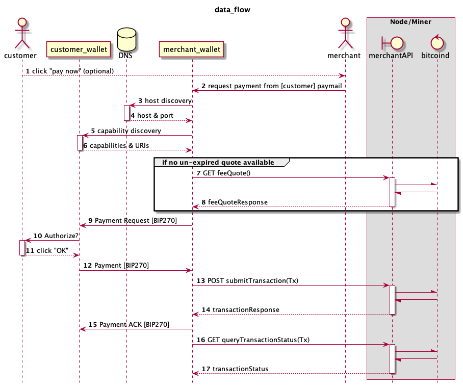

## RFC Notice

ReadMe version 1.5.0.

This draft spec is released as an RFC (request for comment) as part of the public review process. Any comments, criticisms or suggestions should be directed toward the [issues page](https://github.com/bitcoin-sv-specs/brfc-merchantapi/issues) on this github repository.

A reference implementation of the Merchant API server is available [here](https://github.com/bitcoin-sv/merchantapi-reference).

# mAPI Specification

|     BRFC     |    title     | authors | version |
| :----------: | :----------: | :-----: | :-----: |
| 5494bcaa549e | mAPI         | nChain  |   1.5.0 |

## Dependency
mAPI v1.5.0 requires BSV Node v1.0.10 or later.

## Overview

Merchant API (mAPI) is an additional service that miners can offer to merchants.
It enables merchants to get policy and fee quotes for submitting transactions, submit the transaction and query the transaction status.

## Enhancements

The following improvements have been made to the specification and mAPI v1.5.0 compliant implementations provide the following:

* Once an implementation accepts a transaction, that commits the implementation to mining the transaction in a future block, which relieves merchants from having to repeatedly query and resubmit their transactions to ensure that they will be mined 
* An indication that the transaction may be resubmitted is given by the submit transaction response payload failureRetryable flag, which relieves merchants from parsing the response resultDescription field to distinguish between bad requests and transient failures
* If the implementation resubmits a transaction or submits a transaction that has already been mined, implementation maps that into a successful result for the merchant, who is able to resubmit without problems even in the case of network failure
* If node fails during submission of a transaction, the implementation automatically resubmits the transaction on behalf of the merchant
* If implementation gets mixed results from multiple nodes, which indicates that at least one node has accepted the transaction, the implementation maps the results into success for the merchant which relieves them from parsing the response to determine what happened and what should be done about it

### Data Flow Diagram



> Note: This protocol uses the [JSON envelopes BRFC](https://github.com/bitcoin-sv-specs/brfc-misc/tree/master/jsonenvelope) as well as the [Fee Spec BRFC](https://github.com/bitcoin-sv-specs/brfc-misc/tree/master/feespec).
> Note: The example JSON below illustrates the syntax and typical data
---

## Implementation

The **REST API** has these endpoints:

1. [Get policy quote](#1-get-policy-quote)
2. [Get fee quote](#2-get-fee-quote)
3. [Submit transaction](#3-submit-transaction)
4. [Query transaction status](#4-query-transaction-status)
5. [Submit multiple transactions](#5-submit-multiple-transactions)
6. [Query transaction outputs](#6-query-transaction-outputs)

### 1. Get policy quote

#### Purpose:

This endpoint is used to get the different policies quoted by a miner. It returns a [JSONEnvelope](https://github.com/bitcoin-sv-specs/brfc-misc/tree/master/jsonenvelope) with a payload that contains the policies used by a specific BSV miner. The purpose of the envelope is to ensure strict consistency in the message content for the purpose of signing responses.
This is a superset of the fee quote service, as it also includes information on DSNT IP addresses and miner policies.

#### Request:

```
GET /mapi/policyQuote
```

#### Response:

HTTP response codes include:

| code | meaning | description |
| ---- | ------- | ----------- |
| 200  | Ok      | has the following JSON body |
| 404  | Not found | policy quote unavailable |

```json
{
  "payload": "{see below}",
  "signature": "3044022020491e059ca6c095464e119ecc7d95554756c1e73afa6f47800e97102224f2f202205f41f45e34cc230a074813e3868225036c464af730bb7a4b8713f4d27e877ada",
  "publicKey": "030d1fe5c1b560efe196ba40540ce9017c20daa9504c4c4cec6184fc702d9f274e",
  "encoding": "UTF-8",
  "mimetype": "application/json"
}
```

| field       | function                                            |
| ----------- | --------------------------------------------------- |
| `payload`   | main data payload encoded in a compressed JSON format  |
| `signature` | signature on the payload string or _null_       |
| `publicKey` | public key to verify signature or _null_    |
| `encoding`  | encoding type for the payload                              |
| `mimetype`  | multipurpose Internet Mail Extensions type for the payload |

##### Expanded Payload:

```json
{
  "apiVersion": "1.5.0",
  "timestamp": "2022-11-04T10:45:29.4034819Z",
  "expiryTime": "2022-11-04T10:55:29.4034819Z",
  "minerId": "030d1fe5c1b560efe196ba40540ce9017c20daa9504c4c4cec6184fc702d9f274e",
  "currentHighestBlockHash": "6114b49cadc9974fe4ef8e82565bae53c58a86d2b1599af845ff953bc8391c6e",
  "currentHighestBlockHeight": 151,
  "fees": [
    {
      "feeType": "standard",
      "miningFee": {
        "satoshis": 500,
        "bytes": 1000
      },
      "relayFee": {
        "satoshis": 250,
        "bytes": 1000
      }
    },
    {
      "feeType": "data",
      "miningFee": {
        "satoshis": 500,
        "bytes": 1000
      },
      "relayFee": {
        "satoshis": 250,
        "bytes": 1000
      }
    }
  ],
  "callbacks": [
    {
      "ipAddress": "123.456.789.123"
    }
  ],
  "policies": {
    "skipscriptflags": [
      "MINIMALDATA",
      "DERSIG",
      "NULLDUMMY",
      "DISCOURAGE_UPGRADABLE_NOPS",
      "CLEANSTACK"
    ],
    "maxtxsizepolicy": 99999,
    "datacarriersize": 100000,
    "maxscriptsizepolicy": 100000,
    "maxscriptnumlengthpolicy": 100000,
    "maxstackmemoryusagepolicy": 10000000,
    "limitancestorcount": 1000,
    "limitcpfpgroupmemberscount": 10,
    "acceptnonstdoutputs": true,
    "datacarrier": true,
    "maxstdtxvalidationduration": 99,
    "maxnonstdtxvalidationduration": 100,
    "minconsolidationfactor": 10,
    "maxconsolidationinputscriptsize": 100,
    "minconfconsolidationinput": 10,
    "acceptnonstdconsolidationinput": false
  }
}
```
> Note: BSV Node v1.0.11 does not support "dustlimitfactor" and "dustrelayfee" policies, so they should not have been configured and will not be contained within the response

| field                       | function                                                                                     |
| --------------------------- | -------------------------------------------------------------------------------------------- |
| `apiVersion`                | version of the merchant API specification used                                                                 |
| `timestamp`                 | timestamp of the payload document                                                                |
| `expiryTime`                | expiry time of quote                                                                         |
| `minerId`                   | minerID / public key of miner or _null_                                           |
| `currentHighestBlockHash`   | hash of the current blockchain tip                                                               |
| `currentHighestBlockHeight` | height of the current blockchain tip                                                               |
| `fees`          | fees charged by the miner (see [feeSpec BRFC](https://github.com/bitcoin-sv-specs/brfc-misc/tree/master/feespec))  |
| `callbacks`     | IP addresses of double-spend notification servers such as mAPI reference implementation |
| `policies`      | values of miner policies as configured by the mAPI reference implementation administrator (examples above) |

### 2. Get fee quote

#### Purpose:

This endpoint is used to get the different fees quoted by a miner. It returns a [JSONEnvelope](https://github.com/bitcoin-sv-specs/brfc-misc/tree/master/jsonenvelope) with a payload that contains the fees charged by a specific BSV miner. The purpose of the envelope is to ensure strict consistency in the message content for the purpose of signing responses.
This is a subset of the policy quote service.

#### Request:

```
GET /mapi/feeQuote
```

#### Response:

HTTP response codes include:

| code | meaning | description |
| ---- | ------- | ----------- |
| 200  | Ok      | has the following JSON body |
| 404  | Not found | fee quote unavailable |

```json
{
  "payload": "{see below}",
  "signature": "3044022073df67507d4165b2973553c25bd8764891adb46990736bf62ec9ec732b05312e02203b49e9a5b080bdd1e8037032227c6a9f91266bf722337e8f930ff8f96b3b667d",
  "publicKey": "030d1fe5c1b560efe196ba40540ce9017c20daa9504c4c4cec6184fc702d9f274e",
  "encoding": "UTF-8",
  "mimetype": "application/json"
}
```

The field definitions are the same as policy quote, above.

##### Expanded Payload:

```json
{
  "apiVersion": "1.5.0",
  "timestamp": "2022-11-04T10:24:20.9876978Z",
  "expiryTime": "2022-11-04T10:34:20.9876978Z",
  "minerId": "030d1fe5c1b560efe196ba40540ce9017c20daa9504c4c4cec6184fc702d9f274e",
  "currentHighestBlockHash": "0de6608a75807ac1e2320851a355e4a804731d3c48478a527777da67bb1543ab",
  "currentHighestBlockHeight": 151,
  "fees": [
    {
      "feeType": "standard",
      "miningFee": {
        "satoshis": 500,
        "bytes": 1000
      },
      "relayFee": {
        "satoshis": 250,
        "bytes": 1000
      }
    },
    {
      "feeType": "data",
      "miningFee": {
        "satoshis": 500,
        "bytes": 1000
      },
      "relayFee": {
        "satoshis": 250,
        "bytes": 1000
      }
    }
  ],
  "callbacks": [
    {
      "ipAddress": "123.456.789.123"
    }
  ]
}
```

The field definitions are the same as policy quote, above.

### 3. Submit transaction

#### Purpose:

This endpoint is used to send a raw transaction to a miner for inclusion in the next block that the miner creates. It returns a [JSONEnvelope](https://github.com/bitcoin-sv-specs/brfc-misc/tree/master/jsonenvelope) with a payload that contains the response to the transaction submission. The purpose of the envelope is to ensure strict consistency in the message content for the purpose of signing responses.

#### Request:

```
POST /mapi/tx
```

##### JSON Body:

Set `Content-Type` to `application/json`:

```json
{
  "rawtx": "[transaction_hex_string]",
  "callbackUrl": "https://your.service.callback/endpoint",
  "callbackToken": "<channel token>",
  "merkleProof": true,
  "merkleFormat": "TSC",
  "dsCheck": true,
  "callbackEncryption": "<parameter>"
}
```
##### Binary Data

Set `Content-Type` to `application/octet-stream`.

Submit the transaction with the binary serialized transaction in the request body. You can specify the fields in the query string.

For large transactions, binary is half the size of the hexadecimal equivalent although this gain is largely minimized through the use of gzip encoding of the hex data.

| field                       | function            |
| ----------------------------|---------------------|
| `rawtx`         | Hex encoded transaction   |
| `callbackUrl`   | HTTP(S) endpoint used to receive messages from the miner   |
| `callbackToken` | HTTP authorization header used when authenticating against callbackUrl |
| `merkleProof`   | used to request a Merkle proof    |
| `merkleFormat`  | (optional) returns TSC compliant Merkle proof format if set to "TSC"   |
| `dsCheck`       | used to request double spend notification  |
| `callbackEncryption`   | (optional) parameter to encrypt callback data     |


*Note:*  In mAPI 1.4.0, the supported encryption method is libsodium sealed_box which is an anonymous (you can not identify the sender) public key encryption with integrity check (for more details see: https://libsodium.gitbook.io/doc/public-key_cryptography/sealed_boxes)

The format of the callbackEncryption parameter is:

    libsodium sealed_box <base64 encoded encryption key>


#### Response:

HTTP response codes include:

| code | meaning | description |
| ---- | ------- | ----------- |
| 200  | Ok      | has the following JSON body |
| 4xx  | Client error | recoverable - correct the error (such as unauthorized) and resubmit the transaction |
| 500  | Server error | node is reset or safe mode is triggered |
| 503  | Server error | node is unreachable |
| 5xx  | Server error | possibly recoverable – retry later |

There is a small possibility that under exceptional circumstances no response will be forthcoming.

For this reason, the merchant may wish to keep a record of all transactions submitted, and if no response is obtained within an acceptable timescale, the transaction may be resubmitted.

```json
{
  "payload": "{see below}",
  "signature": "304402201ced51b2b7043b8c4dbda6d161f4946638dc4544ab6e7b50d1aae5286d246102022046d2ae28ed6b3ac1e76e535b284053ef3676fd847386acfbfa69c25cd4ad9c42",
  "publicKey": "030d1fe5c1b560efe196ba40540ce9017c20daa9504c4c4cec6184fc702d9f274e",
  "encoding": "UTF-8",
  "mimetype": "application/json"
}
```

The fields are specified above.

##### Expanded Payload:

```json
{
  "apiVersion": "1.5.0",
  "timestamp": "2022-11-04T11:15:05.3509086Z",
  "txid": "a5e22349ea116a2625f0efe94c827edf0144a18ca6293cb76996f86502b45854",
  "returnResult": "success",
  "resultDescription": "",
  "minerId": "030d1fe5c1b560efe196ba40540ce9017c20daa9504c4c4cec6184fc702d9f274e",
  "currentHighestBlockHash": "1c748a050a366a7526d62fb9bba21145a8ba4d2e9b35facada6bf433cae57195",
  "currentHighestBlockHeight": 151,
  "txSecondMempoolExpiry": 0,
  "warnings": [],
  "failureRetryable": false
}
```

| field                   | function       |
| ----------------------- | -------------- |
| `txid`                  | transaction ID |
| `returnResult`          | will contain either `success` or `failure` |
| `resultDescription`     | will contain the error on `failure` or empty on `success`|
| `txSecondMempoolExpiry` | duration (minutes) Tx will be kept in the secondary mempool |
| `warnings`              | any DSNT protocol warnings provided by the system |
| `failureRetryable`      | if true indicates that the transaction may be resubmitted later |
| `conflictedWith`        | list of double spend transactions |

If returnResult is failure and failureRetryable is true, node probably has a temporary issue with the transaction. Retry or change the inputs and submit the new transaction.

If a double spend notification or Merkle proof is requested in Submit transaction, the Merkle proof or double spend notification will be sent to the specified callbackUrl. Where recipients are using [SPV Channels](https://github.com/bitcoin-sv-specs/brfc-spvchannels), this would require the recipient to have a channel set up and ready to receive messages. See [Callback Notifications](#callback-notifications) for details.

#### Callback Reason

There is an option for the miner to provide a callback reason using `{callbackReason}` to enable client applications to determine what type of callback is returned, for example, Merkle proof or double spend.

#### Request:
```json
{ 
  "rawtx": "0100000001146124b21b5f47c0f73f2e6f3330ec16767fbe1b2a7d7e59910dafa373f20cc4010000006a473044022004518512354059aa97a59e371b03b5279a4d893d6db674e7c9228ccdd0e98bd8022032fb064e2324100fb0a7bfa23a66f62ce23b751b1babc58f1f827e2c26e6f10c4121027ae06a5b3fe1de495fa9d4e738e48810b8b06fa6c959a5305426f78f42b48f8cffffffff0198929800000000001976a91482932cf55b847ffa52832d2bbec2838f658f226788ac00000000", 
  "merkleProof": true, 
  "merkleFormat": "TSC", 
  "dsCheck": true, 
  "callbackUrl" : "https://your-server/api/v1/channel/533", 
  "callbackToken": "CNaecHA44nGNJCvvccx3TSxwb4F490574knnkf44S19W6cNmbumVa6k3ESQw"
}
```
#### Response:

An example TSC compliant Merkle proof callback, which will be sent to `https://your-server/api/v1/channel/533/merkleProof`:
```json
{
  "callbackPayload": {
    "index": 1,
    "txOrId": "0ad8f51caafee78f59faeff5dfe15d84da5e4069f64353590cd523c0d24a4287",
    "targetType": "header",
    "target": "00000020e0b910e459b3547178c7bdde08e8cca07e12c79c3f78338ba540a20a1dfcb14a24778a76dc738a580df230c34db78fab25e25b6b6fe55e460b1245529583d53781ab6863ffff7f2002000000",
    "nodes": [
      "1a8e965ae9197e2a62d3c0a067a84de6108be89cce131bab0bcccaa1afb26542"
    ]
  },
  "apiVersion": "1.5.0",
  "timestamp": "2022-11-07T06:53:31.9199309Z",
  "blockHash": "33e3843a642788586cc28cb9748e150335e4365d73eff6d4e9c63a4bda629070",
  "blockHeight": 153,
  "callbackTxId": "0ad8f51caafee78f59faeff5dfe15d84da5e4069f64353590cd523c0d24a4287",
  "callbackReason": "merkleProof"
}
```

### 4. Query transaction status

#### Purpose:
This endpoint is used to check the current status of a previously submitted transaction. It returns a [JSONEnvelope](https://github.com/bitcoin-sv-specs/brfc-misc/tree/master/jsonenvelope) with a payload that contains the transaction status. The purpose of the envelope is to ensure strict consistency in the message content for the purpose of signing responses.

#### Request:
```
GET /mapi/tx/{txid}?merkleProof=bool&merkleFormat=TSC
```

| parameter | description |
| ----------| ----------- |
| `txid` | hex encoded transaction ID |
| `merkleProof` | optional specifying whether any available Merkle proof should be provided – default is false |
| `merkleFormat` | optional specifying the format of any Merkle proof returned – default is the recommended [TSC](https://tsc.bitcoinassociation.net/standards/merkle-proof-standardised-format/) |

#### Response:

HTTP response codes include:

| code | meaning | description |
| ---- | ------- | ----------- |
| 200  | Ok      | has the following JSON body |
| 400  | Bad Request | invalid transaction ID |

An example response with TSC compliant Merkle proof requested:
```json
{
  "payload": "{see below}",
  "signature": "3044022032ae5d570925bf9ba232fe54adc34f4794d5175132cac1e800d57b5ddfc10533022042ecc728c73a51dc3742a811de0f3ee7c1416877b6e0327703547e95f0f3ab3f",
  "publicKey": "030d1fe5c1b560efe196ba40540ce9017c20daa9504c4c4cec6184fc702d9f274e",
  "encoding": "UTF-8",
  "mimetype": "application/json"
}
```

The fields are specified above.

##### Expanded Payload:

```json
{
  "apiVersion": "1.5.0",
  "timestamp": "2022-11-04T11:15:05.4765751Z",
  "txid": "a5e22349ea116a2625f0efe94c827edf0144a18ca6293cb76996f86502b45854",
  "returnResult": "success",
  "blockHash": "1e22f9ffbb2dd74404f72b9e8d9699552c0579d30a393527670450e84ab378a9",
  "blockHeight": 152,
  "confirmations": 1,
  "minerId": "030d1fe5c1b560efe196ba40540ce9017c20daa9504c4c4cec6184fc702d9f274e",
  "txSecondMempoolExpiry": 0,
  "merkleProof": {
    "index": 1,
    "txOrId": "a5e22349ea116a2625f0efe94c827edf0144a18ca6293cb76996f86502b45854",
    "targetType": "header",
    "target": "000000209571e5ca33f46bdacafa359b2e4dbaa84511a2bbb92fd626756a360a058a741c221a119911da40faccc8005f93b2c696a383f76303d8d39b82668bb8b8fc71f453f46463ffff7f2000000000",
    "nodes": [
      "6969cfc4ca0956afb5bc06d9ad7595dc3ebbcf533bbfbf3d0901d81ee94f3826",
      "054cd18407e15dfd6c088aab4e577822ef536556d3a0346e69ef1ba90ca5ad25"
    ]
  }
}
```
The Merkle proof is provided and is compliant with the [TSC Specification](https://tsc.bitcoinassociation.net/standards/merkle-proof-standardised-format/).

#### Alternative Response:

```json
{
    "payload": "{see below}",
    "signature": "3044022072400cf95d26d7de612745168ac96f0c64caa499630e3a9dba49d951b433bc880220504a50d20dc051f2950df22ea0f4ba96f38461e827ab8a129865f2bfb8f94dc0",
    "publicKey": "030d1fe5c1b560efe196ba40540ce9017c20daa9504c4c4cec6184fc702d9f274e",
    "encoding": "UTF-8",
    "mimetype": "application/json"
}
```

The fields are specified above.

##### Expanded Payload:

```json
{
  "apiVersion": "1.5.0",
  "timestamp": "2022-11-04T11:15:05.4941355Z",
  "txid": "a5e22349ea116a2625f0efe94c827edf0144a18ca6293cb76996f86502b45854",
  "returnResult": "success",
  "blockHash": "1e22f9ffbb2dd74404f72b9e8d9699552c0579d30a393527670450e84ab378a9",
  "blockHeight": 152,
  "confirmations": 1,
  "minerId": "030d1fe5c1b560efe196ba40540ce9017c20daa9504c4c4cec6184fc702d9f274e",
  "txSecondMempoolExpiry": 0
}
```

| field                   | function                                                |
| ----------------------- | ------------------------------------------------------- |
| `blockHash`             | hash of tx block                                        |
| `blockHeight`           | height of tx block                                      |
| `confirmations`         | number of block confirmations                           |

### 5. Submit multiple transactions

#### Purpose:

This endpoint is used to send multiple raw transactions to a miner for inclusion in the next block that the miner creates. It returns a [JSONEnvelope](https://github.com/bitcoin-sv-specs/brfc-misc/tree/master/jsonenvelope) with a payload that contains the responses to the transaction submissions. The purpose of the envelope is to ensure strict consistency in the message content for the purpose of signing responses.

#### Request:

```
POST /mapi/txs
```

##### JSON Body:

Where `Content-Type` is `application/json`.

```json
[
    {
        "a transaction as above"
    },
    {
        "any number of additional transactions"
    }
]
```

You can also omit *callbackUrl*, *callbackToken*, *merkleProof*,*merkleFormat* and *dsCheck* from the request body and provide the default values in the query string.

#### Response:

HTTP response codes include:

| code | meaning | description |
| ---- | ------- | ----------- |
| 200  | Ok      | has the following JSON body |
| 400  | Bad Request | invalid request |

```json
{
  "payload": "{see below}",
  "signature": "304402207fee9b97fcbc6783848ce266d27d9454ac02e963d431b46eb6c9de8da308f9a402203dfed83378d136665a5a7ced1147fd7ba3dd59040b354aa5fb307c5fab484ab9",
  "publicKey": "030d1fe5c1b560efe196ba40540ce9017c20daa9504c4c4cec6184fc702d9f274e",
  "encoding": "UTF-8",
  "mimetype": "application/json"
}
```

The fields are specified above.

##### Expanded Payload:

```json
{
  "apiVersion": "1.5.0",
  "timestamp": "2022-11-04T11:36:51.6458429Z",
  "minerId": "030d1fe5c1b560efe196ba40540ce9017c20daa9504c4c4cec6184fc702d9f274e",
  "currentHighestBlockHash": "3ebda38de3d491626bd2e971d0b0c4fb013a50db4e726e07d95d4c4101f9f351",
  "currentHighestBlockHeight": 151,
  "txSecondMempoolExpiry": 0,
  "txs": [
    {
      "txid": "7fb40b4c18ca267aa5ab3a042ef8608c1f90e73ff171ce876c2d2242ed79c65d",
      "returnResult": "failure",
      "resultDescription": "Missing inputs",
      "failureRetryable": false
    },
    {
      "txid": "9bb85570cc2117aa6ddbf36c88e4111a5d5af7a454f39fda957f295f110a9908",
      "returnResult": "failure",
      "resultDescription": "18 txn-double-spend-detected",
      "failureRetryable": false,
      "conflictedWith": [
        {
          "txid": "da8b5b87a013fcf86d830541ccb6e96bea10727e6f4cc19c388f37b116623af6",
          "size": 191,
          "hex": "0100000001de83b214c2403e126ba8641417f28166faf09d349de4b0dc1afd9d4c06d9458a000000006a473044022066ee22d714cfcda6497243fb281b88688a69b294a9fe09bfbdba7f8a1c80d850022073878eae7c775cb29dc1162a56bce173e6c31cc227f692f49176c42dbfa523654121027ae06a5b3fe1de495fa9d4e738e48810b8b06fa6c959a5305426f78f42b48f8cffffffff0198929800000000001976a91482932cf55b847ffa52832d2bbec2838f658f226788ac00000000"
        }
      ]
    },
    {
      "txid": "da8b5b87a013fcf86d830541ccb6e96bea10727e6f4cc19c388f37b116623af6",
      "returnResult": "success",
      "resultDescription": "",
      "warnings": [],
      "failureRetryable": false
    }
  ],
  "failureCount": 2
}
```

| field          | function                                 |
| -------------- | ---------------------------------------- |
| `txs`          | list of transaction responses            |
| `failureCount` | number of failed transaction submissions |


To submit a transaction in binary format use `Content-Type: application/octet-stream` Content-Type: application/octet-stream with the binary serialized transactions in the request body. Use query string to specify the remaining parameters.

#### Double Spend Attempts

It is possible that more than one transaction in the batch attempts to spend the same input from the batch. This is a double-spend attempt. mAPI does not attempt to detect this, instead the transactions are passed to the BSV Node which will detect the double spend attempt and reject one or more transactions, in a similar manner to the response shown above. This will also happen when the inputs are a double-spend attempt from earlier transactions i.e. not just in the same batch of transactions.

### 5. Query transaction outputs

#### Purpose:
This endpoint is used to check the status of transaction outputs. This could be because an interested party wants to know their value, or some other information. 

The user may elect to search just the blockchain, or the blockchain and the mempool, for the transaction. The user may also elect to only return some information fields, or all information fields.

Multiple outputs may be queried in each request.

It returns a [JSONEnvelope](https://github.com/bitcoin-sv-specs/brfc-misc/tree/master/jsonenvelope) with a payload that contains the transaction status. The purpose of the envelope is to ensure strict consistency in the message content for the purpose of signing responses.

#### Request:
```
POST /mapi/txouts?includeMempool=bool&returnField=confirmations&returnField=value
```

| parameter | description |
| ----------| ----------- |
| `includeMempool` | optional “search mempool” flag, in addition to always searching the blockchain – default is true |
| `returnField` | Optional return named field specifier. Any number of these parameters may be specified in the command. Possible field names are: scriptPubKey, scriptPubKeyLen, value, isStandard and confirmations. The default is all fields |

##### JSON Body:

```json
{
  [
    { "txid": "<transaction-id>", "n": 0 },
    Et cetera
  ]
}
```

| field  | function                                 |
| ------ | ---------------------------------------- |
| `txid` | transaction ID of the transaction in question  |
| `n`    | index of the output in the transaction |

#### Example Request:

```
POST /mapi/txouts?includeMempool=false
```

```json
{
  [
    { "txid": "0bc1733f05aae146c3641fd...57f60f19a430ffe867020619d54800", "n": 0 },
    { "txid": "d013adf525ed5feaffc6e9d...40566470181f099f1560343cdcfd00", "n": 0 },
    { "txid": "d013adf525ed5feaffc6e9d...40566470181f099f1560343cdcfd00", "n": 1 }
  ]
}
```

#### Example Response:

```json
{
  "payload": "{see below}",
  "signature": "3044022070fe38f31e960d1116dab5d077b2f2a1c4ab1357bf8ba09dd5177df98bb0a86c02202eba4c49c3dabcba1d4ca6b5db5b355704819f99d0406856e33f8d221d8ae3d4",
  "publicKey": "030d1fe5c1b560efe196ba40540ce9017c20daa9504c4c4cec6184fc702d9f274e",
  "encoding": "UTF-8",
  "mimetype": "application/json"
}
```

##### Expanded Payload:

```json
{
  "apiVersion": "1.5.0",
  "timestamp": "2022-11-04T09:44:29.7095472Z",
  "minerId": "030d1fe5c1b560efe196ba40540ce9017c20daa9504c4c4cec6184fc702d9f274e",
  "returnResult": "success",
  "txouts": [
    {
      "scriptPubKeyLen": 25,
      "confirmations": 1
    },
    {
      "error": "spent",
      "collidedWith": {
        "txid": "40577399c21b680c28b03d0d0c8ae6330539c9ff538955a25ff0bd0b53aa9136",
        "size": 191,
        "hex": "010000000175d5ae40a19cc2eeb9d6d2939ee0f2769f79376969d9547df521f19f1266fc06000000006a473044022003ae93c8b0bebf06ee66d1d82a9dd24f5d540a507b35707b1494152e225e216102200578d481aaa36a0d14697eb1bf2dfce62ddb2725c20ab6da0a2bea05616fe03e4121027ae06a5b3fe1de495fa9d4e738e48810b8b06fa6c959a5305426f78f42b48f8cffffffff01b08e9800000000001976a91482932cf55b847ffa52832d2bbec2838f658f226788ac00000000"
      }
    },
    {
      "scriptPubKeyLen": 25,
      "confirmations": 0
    },
    {
      "error": "missing"
    }
  ]
}
```

In this example, the “txouts” array aligns with the input transaction requests. 
The first entry shows all the fields requested about the transaction output. 
The second entry shows that the txid collided with a different txid. 
The third entry shows all the fields requested about the transaction output.
The fourth entry shows that the transaction output is “missing”. 
This is either because the transaction output has not reached the blockchain, or because it has been spent.

### Callback Notifications

Merchants can request callbacks for *Merkle proofs* and/or *double spend notifications* in Submit transaction.

The tool that builds the transaction, can build a special double-spend notification output according to the [DSNT specification](https://github.com/bitcoin-sv-specs/protocol/blob/master/updates/double-spend-notifications.md).
A DSNT server must be used to communicate with node. The mAPI reference implementation is a DSNT server, so the IP address of that can be used in the DSNT transaction output.
That information is made available in response to a GET policy quote command (above).

This will allow node to invoke the mAPI reference implmentation if a double spend is detected. That, in turn, will cause a callback to any callbackUrl supplied in submit transaction (above).


Double Spend example:
```
POST /mapi/tx
```

#### Request:

Request Body:

```json
{
    "rawtx": "0100000001106d69baf775bf023e98c713b78d8df44a07ab06c2e38598e52b223cef4d71f4010000006a47304402200254591bed254f9022eb8b119bebc2e79017d413fa1d1a05f4b6b7d101363a3c022040390ae692b83a852d61c062d93ee584354f61cd0ea8b930a8108b6d4e4217204121027ae06a5b3fe1de495fa9d4e738e48810b8b06fa6c959a5305426f78f42b48f8cffffffff0298929800000000001976a91482932cf55b847ffa52832d2bbec2838f658f226788ac000000000000000010006a0464736e740801017f000001010000000000",
    "callbackUrl": "https://your-server/api/v1/channel/533",
    "callbackToken": "CNaecHA44nGNJCvvccx3TSxwb4F490574knnkf44S19W6cNmbumVa6k3ESQw",
    "merkleProof": false,
    "merkleFormat": "",
    "dsCheck": true
}
```

#### Response:
```json
{
  "payload": "{
    "apiVersion": "1.5.0",
    "timestamp": "2022-11-07T07:05:37.9417712Z",
    "txid": "8bd5ce05e88761060d86a8ad17dd523b1e0031b922c6890f2c09204286f694d3",
    "returnResult": "success",
    "resultDescription": "",
    "minerId": "030d1fe5c1b560efe196ba40540ce9017c20daa9504c4c4cec6184fc702d9f274e",
    "currentHighestBlockHash": "2132371c818dfd45f0ff34e74c30ca80ea9054d02f43d5cbc8177c548acd5e1a",
    "currentHighestBlockHeight": 151,
    "txSecondMempoolExpiry": 0,
    "warnings":[],
    "failureRetryable": false
  }",
  "signature": "3044022076a40fcbb4348e86e99c2703cc5dc4842ca1170b0cb3c3ad98d7d52abe32d46f022029556cf236d224ff513c2c926db2b0312b13885e88416bb46894da45b1e51350",
  "publicKey": "030d1fe5c1b560efe196ba40540ce9017c20daa9504c4c4cec6184fc702d9f274e",
  "encoding": "UTF-8",
  "mimetype": "application/json"
}
```

Merkle proof callback can be requested by specifying:
```json
{
  "merkleProof": true,
  "merkleFormat": "TSC"
}
```
If the optional merkleFormat is set to "TSC" then a TSC compliant version of the merkle proof is returned.

If callback was requested on Submit transaction, the merchant will receive a notification of doublespend and/or merkle proof via the callback URL. mAPI processes all requested notifications and sends them out in batches.
Callbacks have these possible callbackReasons: "doubleSpend", "doubleSpendAttempt" and "merkleProof". DoubleSpendAttempt implies that a double spend was detected in the mempool.

Double spend callback example:
```json
{
  "callbackPayload": {
    "doubleSpendTxId": "7dddd41d4f1443bd02490ffbcadc746e47db320e8cd7f434fb1e6c2d6676fb5f",
    "payload": "0100000001106d69baf775bf023e98c713b78d8df44a07ab06c2e38598e52b223cef4d71f4010000006a47304402205bb1b0f4989940fb532e61b7bfc531a8b0a9b76e520c7d5048c3202cb90984d102202cb77d7e03cb68e0d306db330e90b548d3f0cf705cf237d918bdbea7c351ddc94121027ae06a5b3fe1de495fa9d4e738e48810b8b06fa6c959a5305426f78f42b48f8cffffffff018c949800000000001976a91482932cf55b847ffa52832d2bbec2838f658f226788ac00000000"
  },
  "apiVersion": "1.5.0",
  "timestamp": "2022-11-07T07:05:39.6319722Z",
  "blockHash": "45eb0406bc8ff14c0cf90af391a3d3a22e22ea948c32d50e81f1a4dc2cf1d7cf",
  "blockHeight": 152,
  "callbackTxId": "8bd5ce05e88761060d86a8ad17dd523b1e0031b922c6890f2c09204286f694d3",
  "callbackReason": "doubleSpend"
}
```

| field                   | function                                                |
| ----------------------- | ------------------------------------------------------- |
| `callbackPayload`       | payload with information about the new transaction          |
| `blockHash`             | hash of tx block                                        |
| `blockHeight`           | height of tx block                                      |
| `callbackTxId`          | tx with requested dsCheck                               |
| `callbackReason`        | the reason for the callback                                 |

Double spend attempt callback example:
```json
{
  "callbackPayload": {
    "doubleSpendTxId": "7dddd41d4f1443bd02490ffbcadc746e47db320e8cd7f434fb1e6c2d6676fb5f",
    "payload": "0100000001106d69baf775bf023e98c713b78d8df44a07ab06c2e38598e52b223cef4d71f4010000006a47304402205bb1b0f4989940fb532e61b7bfc531a8b0a9b76e520c7d5048c3202cb90984d102202cb77d7e03cb68e0d306db330e90b548d3f0cf705cf237d918bdbea7c351ddc94121027ae06a5b3fe1de495fa9d4e738e48810b8b06fa6c959a5305426f78f42b48f8cffffffff018c949800000000001976a91482932cf55b847ffa52832d2bbec2838f658f226788ac00000000"
  },
  "apiVersion": "1.5.0",
  "timestamp": "2022-11-07T07:05:38.04574Z",
  "blockHash": "",
  "blockHeight": -1,
  "callbackTxId": "8bd5ce05e88761060d86a8ad17dd523b1e0031b922c6890f2c09204286f694d3",
  "callbackReason": "doubleSpendAttempt"
}
```

Merkle proof callback example:
```json
{
  "callbackPayload": {
    "flags": 2,
    "index": 1,
    "txOrId": "0ad8f51caafee78f59faeff5dfe15d84da5e4069f64353590cd523c0d24a4287",
    "target": {
      "hash": "33e3843a642788586cc28cb9748e150335e4365d73eff6d4e9c63a4bda629070",
      "confirmations": 1,
      "height": 153,
      "version": 536870912,
      "versionHex": "20000000",
      "merkleroot": "37d583955245120b465ee56f6b5be225ab8fb74dc330f20d588a73dc768a7724",
      "num_tx": 2,
      "time": 1667804033,
      "mediantime": 1667804032,
      "nonce": 2,
      "bits": "207fffff",
      "difficulty": 4.656542373906925E-10,
      "chainwork": "0000000000000000000000000000000000000000000000000000000000000134",
      "previousblockhash": "4ab1fc1d0aa240a58b33783f9cc7127ea0cce808debdc7787154b359e410b9e0"
    },
    "nodes": [
      "1a8e965ae9197e2a62d3c0a067a84de6108be89cce131bab0bcccaa1afb26542"
    ]
  },
  "apiVersion": "1.5.0",
  "timestamp": "2022-11-07T06:53:31.9136093Z",
  "blockHash": "33e3843a642788586cc28cb9748e150335e4365d73eff6d4e9c63a4bda629070",
  "blockHeight": 153,
  "callbackTxId": "0ad8f51caafee78f59faeff5dfe15d84da5e4069f64353590cd523c0d24a4287",
  "callbackReason": "merkleProof"
}
```

TSC Merkle proof callback example:
```json
{
  "callbackPayload": {
    "index": 1,
    "txOrId": "0ad8f51caafee78f59faeff5dfe15d84da5e4069f64353590cd523c0d24a4287",
    "targetType": "header",
    "target": "00000020e0b910e459b3547178c7bdde08e8cca07e12c79c3f78338ba540a20a1dfcb14a24778a76dc738a580df230c34db78fab25e25b6b6fe55e460b1245529583d53781ab6863ffff7f2002000000",
    "nodes": [
      "1a8e965ae9197e2a62d3c0a067a84de6108be89cce131bab0bcccaa1afb26542"
    ]
  },
  "apiVersion": "1.5.0",
  "timestamp": "2022-11-07T06:53:31.9199309Z",
  "blockHash": "33e3843a642788586cc28cb9748e150335e4365d73eff6d4e9c63a4bda629070",
  "blockHeight": 153,
  "callbackTxId": "0ad8f51caafee78f59faeff5dfe15d84da5e4069f64353590cd523c0d24a4287",
  "callbackReason": "merkleProof"
}
```

--oOo--


